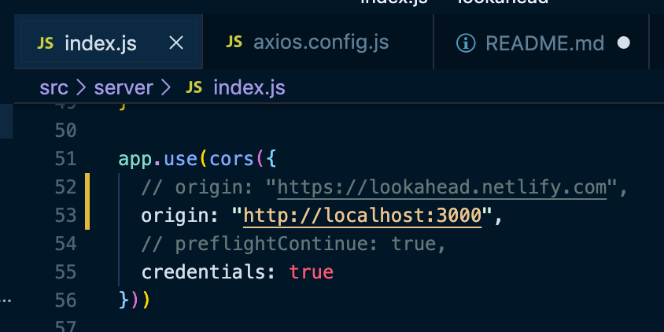
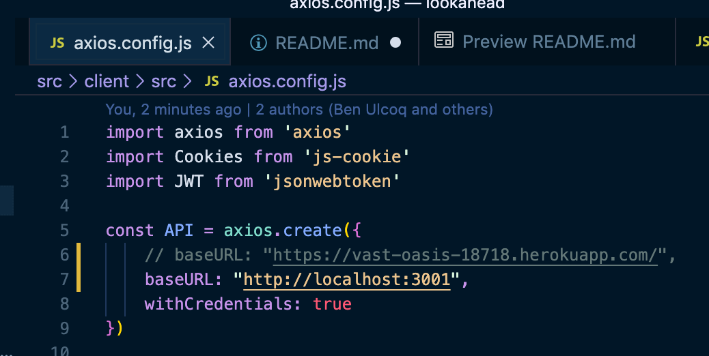

# T3A2 Part B | Alex Leybourne, Ben Ulcoq, Santiago Chamon :sweet_potato: ⚛️

Deployed Site: [Lookahead App](https://lookahead.netlify.com/)

Backend Server: [Server](https://vast-oasis-18718.herokuapp.com)

## Instructions for Development
To get the dev version of Lookahead working locally, make sure you:
  - `src/server/index.js`

    Comment out line `src/server/index.js:52`

    Uncomment line `src/server/index.js:53` so the origin is `"http://localhost:3000"`

    

  - `src/client/src/axios.config.js`

    Comment out line `src/client/src/axios.config.js:6`

    Uncomment line `src/client/src/axios.config.js:7` so the origin is `"http://localhost:3001"`

    

## Instructions for deploying to Production
  - To deploy to production, you essentially need to do the opposite of the commands above
  - Make sure that when you push a PR to master, your `baseUrls` are pointing to the production URLs

  ### Deploying the Backend
  - Merge your changes onto the repo's master then push the `server` sub-folder to Heroku

  ### Deploying the Frontend
  - Merging your changes onto the repo's master should automatically trigger a new Netlify build.

## Troubleshooting
  - On your local dev environment:
    - Make sure your `baseUrls` are pointing to the development localhost URLs
    - Make sure you are running the mongo server in the background with the command 'mongod'
    - Make sure you are running both the client and the server as well

  - On production:
    - If you cannot login on prod, check that the prod code on master is pointing to the correct `baseUrls`
