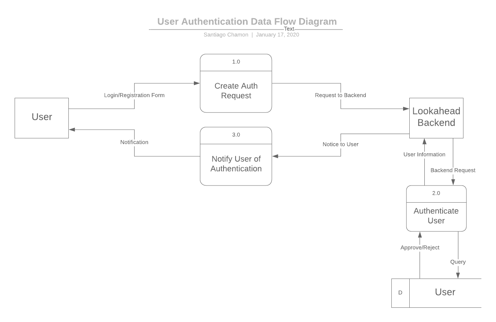
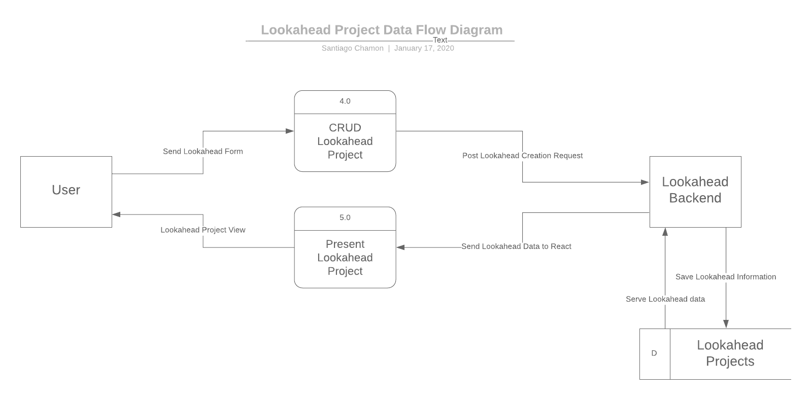
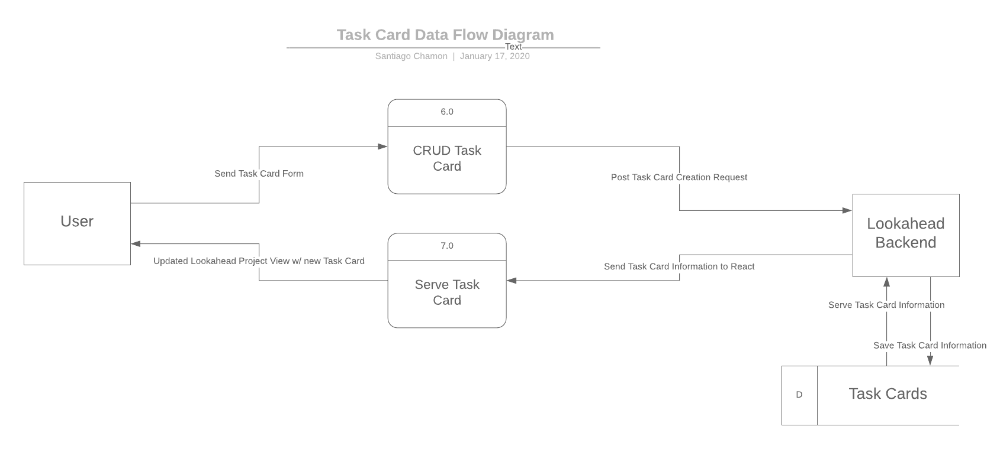
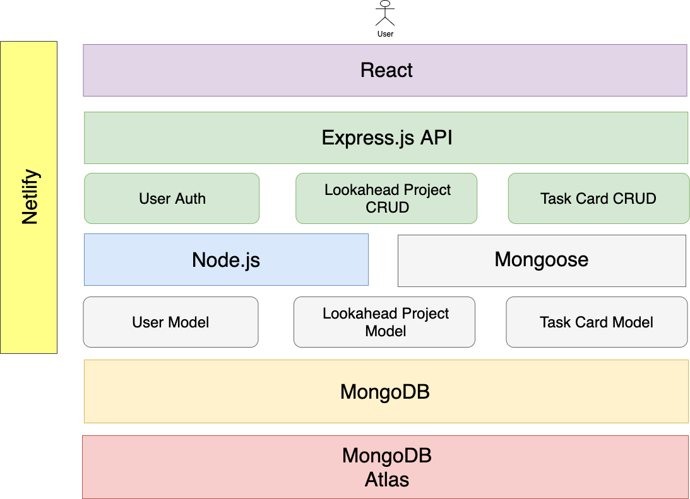

# T3A2 Part A | Alex Leybourne, Ben Ulcoq, Santiago Chamon :sweet_potato: ⚛️

## Purpose
Operational lookaheads are used throughout construction and other industries. Although the specific nature of the operations/tasks they describe may change depending on the sector, the purpose of these simple ‘on-the-ground’ planning tools remain the same: to give all the stakeholders in the operational team a common perspective on what the next 6-7 days of the overall construction project entails - most lookaheads are developed as simple spreadsheets.

The aim of this project is to develop a Single Page Application (SPA) using the MERN stack that serves to replace and improve on the functionality of a spreadsheet for creating and managing lookaheads.

## Functionality / features
In order to build an application that successfully works as an improvement on spreadsheet based lookaheads, there are a number of key features that need to be implemented.  These features are as follows:
* **Project Lookahead CRUD** - Individual ‘lookaheads’ will be able to be created for specific projects. Within these projects, a user can scroll through days and weeks and observe tasks for each day. Projects can also be deleted. The project name can updated and user permissions can be changed - both in terms of accessibility and user roles.
* **Task Cards CRUD** - Within a project, tasks cards can be assigned to given days, times and a task name can assigned. Tasks can be deleted, names can be edited and times and dates can be changed as outlined below.
* **Task Cards Drag n Drop/Expand** - In order to change the time and date of tasks, users will be able to Drag n Drop tasks around days and times. Task length can be expanded by dragging the frame of the task card. This functionality is key to building an application that improves on the spreadsheet capabilities.
* **User Authentication** - The application allows users to create an account using their email address as a unique identifier. In order to view project lookaheads, users must have created an account and be signed in.
* **Authorisation** - Users can only view project lookaheads which they have been granted access to. Within the project, users who have been given a specific role will be able to make adjustments to task cards. If a user has not been granted the necessary role, they will only be able to look through the project and its tasks.

## Target audience
As this application will be built to service industries such as construction, the target audience will be project managers and workers within those areas. Given that the application will be primarily used for ‘on-the-fly’ observations and adjustments in a work-site environment, user experience will need to be smooth and intuitive, particularly across mobile devices.

## Tech stack
The application will be built using the MERN stack as part of the requirements for the assignment this project is being completed for.
The MERN stack is made up of four key components.
* **Node.js** - A Javascript runtime environment used for executing Javascript outside of a web browser.
* **MongoDB** - The database used to typically build MERN stack applications. It is a NoSQL, document-oriented database.
* **MongoDB Atlas** - Global database service where the MongoDB database for this project will be hosted.
* **React** -  A Javascript library that is component based, which is used to build the front-end (user interface) portion of the application. React utilises component states that contains information regarding what should be shown as part of the component. When the state updates, React updates that component within the DOM to reflect that update to the component state - this saves the entire DOM from being updated to reflect changes.
* **Heroku** - [Heroku](https://www.heroku.com/) is a Platform-as-a-Service that allows developers to deploy applications to the cloud. The server side (API) of this project will be hosted on Heroku.
* **Netlify** - another Platform-as-a-Service that allows developers to deploy their web applications quickly. This project will use Netlify to deploy the client application part.
* **Github** -  [Github](https://github.com/)  is a company that provides free remote repository hosting utilising the Git version control system.
Git tracks changes in the application source code in order to manage project development and smooth developer collaboration by automatically handling merges and updates to the code base.
* **Trello** - Used for project management, Trello allows for the creation of Kanban-Style boards.
* **Critical Libraries for the Project**

  - [Mongoose](https://github.com/Automattic/mongoose): MongoDB object modeling designed to work in an asynchronous environment. This is the driver that enables our server to communicate with MongoDB Atlas.
  - [Express](https://github.com/expressjs/express): Fast, unopinionated, minimalist web framework for node. This library is what the project uses to create the server API.
  - [Passport](https://github.com/jaredhanson/passport): Simple, unobtrusive authentication for Node.js. This library will handle authentication in the app.
  - [React-Grid-Layout](https://github.com/STRML/react-grid-layout): A draggable and resizable grid layout with responsive breakpoints, for React. A lot of the drag and drop functioanlity of this project relies on this library.

## Data Flow Diagram

This Data Flow Diagram visualises the main data flows taking place inside the Lookahead application. The main processes of the Application are the authentication of Users, the CRUD (Create, Read, Update, Delete) functionality for Lookahead projects (similar in nature to Trello Boards) and the CRUD functionality for Task Cards (think Trello cards) within Lookahead Projects.

The Data Flow Diagram is broken down into the main data flow avenues shown above in the subsections directly below.

- User Authentication Data Flow

This diagram shows the data flow for authenticating a User. It includes Logging in and Sign up.

- Lookahead Project CRUD Data Flow

- Task Card CRUD Data Flow

## Application Architecture Diagram

This Application Architecture Diagram shows how the Lookahead Application MERN components work with each other. The diagram works in a foundational manner, with the components at the bottom being necessary for the items towards the top. The data in MongoDB is hosted on MongoDB Atlas, with the Back-end communicating with the Database through Mongoose. The Back-end has all the business logic of the application and it passes the data through an Express API to the React Front-end App.

The Back-end is the server side of the application and it will be hosted on Heroku. The Back-end will serve the data to the React App through a series of requests between the Express API and the Front-end App. The user ultimately interacts with the React Front-end App and this React App will be hosted on Netlify.

## Project Management and User Stories

### Overview
Before any planning could take place for this project, the requirements and scope needed to be clearly defined.

To help define and maintain consistent progress towards achieving these requirements, the team elected to work by implementing Agile methodology.
By consistently incorporating client feedback into the design and development process, the overall product was likely to be both easier to develop and also fulfil the clients needs more closely.

Given the fact that the development team and the client were working in different timezones, face-to-face meetings were not an option. As such, a slack channel was set up for quick and easy communication between both parties.

Based on the information provided to the team by the client, preliminary research into what was expected to be achievable in the given timeframe was conducted. Features and functionality were broken down at a high level to help with prioritisation and time management. Once the team had agreed on a MVP functionality, the client was consulted for feedback. The client was happy to proceed with how features had been scoped, and so the team set about planning the project.

### Project Timeline

  
Day 0 - Client Contact and Project Scope

As outlined above, prior to commencement of the project, requirements needed to be defined and features scoped. Once everything was agreed upon, the team set out to plan the project.

Trello was elected as the primary tool for planning the project due to the ability to implement Kanban style boards with significant customisation available. The ability for Trello to connect with Github was also a large factor in choosing the program.

  
Day 1 - Initial User Stories, User Flow, Initial Planning and Setup

With the foundational planning and communication tools in place, the team started by breaking the project features into User Stories using Trello (See Trello Day 1 screenshot). Based on these User Stories, the initial concept for User flow and interface structure was discussed and planned.  The Part A Assignment (documentation) requirements were delegated according to team member strengths and work began across all aspects of the project. The Part A requirements were split across the team as follows:

##### Ben
* R1 - Project Overview
* R4 - User Stories
* R6 - Trello Screenshots

##### Santiago
* R2 - Dataflow Diagram
* R3 - Application Architecture Diagram

##### Alex
* R5 - Wireframes

With all the tasks delegated and initial User Stories completed, they were sent to the client for review.

  
Day 2 - Project Management Tools, Initial Wireframes, User Stories, Data Flow Diagram

With the project now underway, the team continued working on the tasks they had been assigned. The client had reviewed the initial User Stories overnight and was happy with what had been completed.

Initial research was conducted into libraries and tools that could be used during development.

**Team Progress:**

Alex commenced Mobile-First wireframe design in accordance with the user flow that had been established. Once completed, these were sent to the client for review.

Santiago finalised the initial draft of the Data Flow Diagram and sent it to the client for review.

Ben set up a new Trello board for organising the project into Sprints in preparation for setting up a project timeline and formalised task delegation for Part A.

  
Day 3 - Wireframe Updates, Application Architecture, Task Breakdown

Having review the Data Flow Diagram and Wireframe designs, the client gave the team some feedback with regards to User flow which required refinement. The team discussed the feedback and agreed with all points that had been made so set about implementing improvements.

**Team Progress**

In accordance with the feedback provided, Alex refined the Mobile Wireframes and started designing for Tablet.

Santiago commenced work on the Application Architecture Diagram and adjusted the Data flow diagram.

Ben refined the initial User Stories by breaking them down into tasks that were more specific in order to delegate more effectively and allow the team to manage the project at a granular level.

  
Day 4 - Wireframe Finalisation, Diagram Updates,  Issue Mapping and Task Allocation

The team continued working on the assigned tasks.

**Team Progress**

Alex finalised the wireframes for all screen sizes and sent the final design to the client for review.

After review with the team and Coder Academy Educators, Santiago refined both the Data Flow diagram and Application Architecture Diagram to fit with standard diagram conventions.

Ben finalised breaking down User stories and planning sprints. Github Repository issues were created for all key features of the application. Github was connected to the Trello board and User Stories/Tasks were mapped to the relevant Github Issues. Task timeframes, delegation and prioritisation was assigned in preparation for the new Sprint which would be commencing at the beginning of the next week.

  
Day 5 - Review and Documentation Finalisation

The team conducted a final review of all aspects of the documentation that each team member had completed and finalised each component as a group.

Trello Board can be found here: https://trello.com/b/lCfavHOS/sprint-board

## Wireframes

  
Mobile

  

  
Tablet Wireframes

  

  
Desktop Wireframes

  

All created with Figma:
[Figma Project View Link](https://www.figma.com/file/XjnDBsczGMZrKEuaDKpse7/Lookahead?node-id=0%3A1)

This folder contains the stages of refinement for the wireframes based on client feedback:
[Folder Link](https://github.com/llausa/lookahead/tree/master/docs/Wireframes)

## Trello Screenshots of Project

  
Trello Day 1

  

  
Trello Day 2

  

  
Trello Day 3

  

  
Trello Day 4

  

  
Trello Day 5

  

