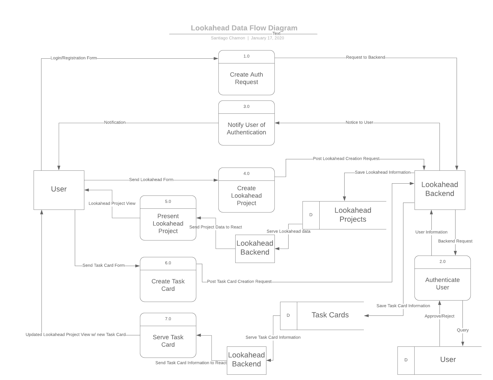

# T3A2 Part A | Alex Leybourne, Ben Ulcoq, Santiago Chamon

## Purpose
Operational lookaheads are used throughout construction and other industries. Although the specific nature of the operations/tasks they describe may change depending on the sector, the purpose of these simple ‘on-the-ground’ planning tools remain the same: to give all the stakeholders in the operational team a common perspective on what the next 6-7 days of the overall construction project entails - most lookaheads are developed as simple spreadsheets.

The aim of this project is to develop a Single Page Application (SPA) using the MERN stack that serves to replace and improve on the functionality of a spreadsheet for creating and managing lookaheads.

## Functionality / features
In order to build an application that successfully works as an improvement on spreadsheet based lookaheads, there are a number of key features that need to be implemented.  These features are as follows:
* **Project Lookahead CRUD** - Individual ‘lookaheads’ will be able to be created for specific projects. Within these projects, a user can scroll through days and weeks and observe tasks for each day. Projects can also be deleted. The project name can updated and user permissions can be changed - both in terms of accessibility and user roles.
* **Task Cards CRUD** - Within a project, tasks cards can be assigned to given days, times and a task name can assigned. Tasks can be deleted, names can be edited and times and dates can be changed as outlined below.
* **Task Cards Drag n Drop/Expand** - In order to change the time and date of tasks, users will be able to Drag n Drop tasks around days and times. Task length can be expanded by dragging the frame of the task card. This functionality is key to building an application that improves on the spreadsheet capabilities.
* **User Sign-in and Sign-Up** - The application allows users to create an account using their email address as a unique identifier. Users are authenticated and authorised for accessing certain information as outlined below.
* **Authentication** - In order to view project lookaheads, users must have created an account and be signed in.
* **Authorisation** - Users can only view project lookaheads which they have been granted access to. Within the project, users who have been given a specific role will be able to make adjustments to task cards. If a user has not been granted the necessary role, they will only be able to look through the project and its tasks.

## Target audience
As this application will be built to service industries such as construction, the target audience will be project managers and workers within those areas. Given that the application will be primarily used for ‘on-the-fly’ observations and adjustments in a work-site environment, user experience will need to be smooth and intuitive, particularly across mobile devices.

## Tech stack
The application will be built using the MERN stack as part of the requirements for the assignment this project is being completed for.
The MERN stack is made up of four key components.
* **Node.js** - A Javascript runtime environment used for executing Javascript outside of a web browser.
* **Express** - A web application framework packaged for use with Node. It facilitates the easy implementation of request routing and creating and utilising middleware to manipulate request and response data.
* **MongoDB** - The database used to typically build MERN stack applications. It is a NoSQL, document-oriented database.
* **React** -  A Javascript library that is component based, which is used to build the front-end (user interface) portion of the application. React utilises component states that contains information regarding what should be shown as part of the component. When the state updates, React updates that component within the DOM to reflect that update to the component state - this saves the entire DOM from being updated to reflect changes.
* **Heroku??**
* **Github** -  [Github](https://github.com/)  is a company that provides free remote repository hosting utilising the Git version control system.
Git tracks changes in the application source code in order to manage project development and smooth developer collaboration by automatically handling merges and updates to the code base.
* **Trello** - Used for project management, Trello allows for the creation of Kanban-Style boards.

## Data Flow Diagram

This Data Flow Diagram visualises the main data flows taking place inside the Lookahead application. The main processes of the Application are the authentication of Users, the CRUD (Create, Read, Update, Delete) functionality for Lookahead projects (similar in nature to Trello Boards) and the CRUD functionality for Task Cards (think Trello cards) within Lookahead Projects.

## Application Architecture Diagram
## User Stories
## Wireframes
## Trello Screenshots of Project

  
Trello Day 1

  

